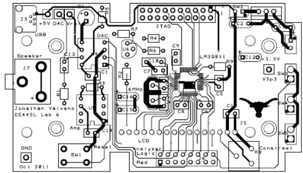
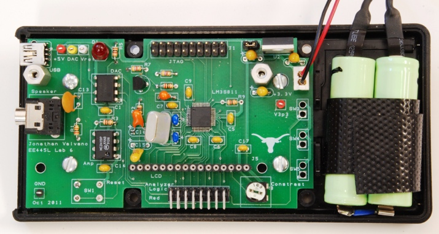
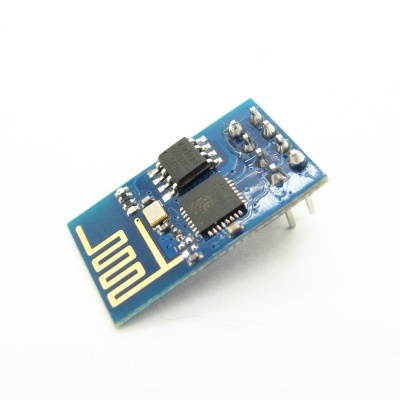
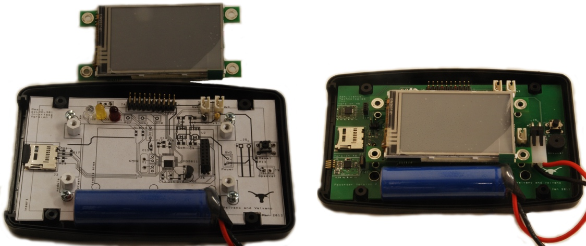
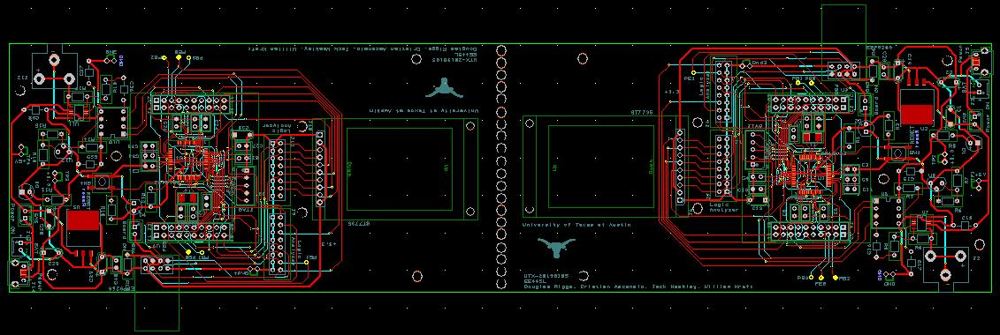

# Lab 7 Design and Layout of an Embedded System

## Table of Contents

- [Lab 7 Design and Layout of an Embedded System](#lab-7-design-and-layout-of-an-embedded-system)
  - [Table of Contents](#table-of-contents)
  - [0 Repository Structure](#0-repository-structure)
    - [0.1 HW](#01-hw)
    - [0.2 SW](#02-sw)
    - [0.3 Resources](#03-resources)
    - [0.4 Git and Github](#04-git-and-github)
  - [1 Summary](#1-summary)
    - [1.1 Goals](#11-goals)
    - [1.2 Team Size](#12-team-size)
    - [1.3 Review](#13-review)
    - [1.4 Stater Files](#14-stater-files)
    - [1.5 Background](#15-background)
    - [1.6 Project Overview](#16-project-overview)
      - [1.6.1 Requirements](#161-requirements)
      - [1.6.2 Constraints](#162-constraints)
      - [1.6.3 Processor Selection](#163-processor-selection)
      - [1.6.4 Optional Components](#164-optional-components)
      - [1.6.5 Design Competition](#165-design-competition)
  - [2 Pre-preparation](#2-pre-preparation)
    - [2.1 Requirements Document](#21-requirements-document)
    - [2.2 Parts](#22-parts)
    - [2.3 Pre-preparation Deliverables](#23-pre-preparation-deliverables)
  - [3 Preparation](#3-preparation)
    - [3.1 Preparation Deliverables](#31-preparation-deliverables)
  - [4 Demo](#4-demo)
    - [4.1 Demo 1](#41-demo-1)
    - [4.2 Demo 1 Deliverables](#42-demo-1-deliverables)
    - [4.3 Demo 2](#43-demo-2)
    - [4.4 Demo 2 Deliverables](#44-demo-2-deliverables)
  - [5 Report](#5-report)
    - [5.1 Deliverables](#51-deliverables)
    - [5.2 Analysis and Discussion Questions](#52-analysis-and-discussion-questions)
  - [6 Grading](#6-grading)
  - [7 Deadlines](#7-deadlines)
  - [8 Additional Information](#8-additional-information)
    - [8.1 Notes](#81-notes)
    - [8.2 Common Mistakes That Ruin Deadlines](#82-common-mistakes-that-ruin-deadlines)

---

## 0 Repository Structure

The typical explanation for the repo structure. Lab specific instructions can be
found further below.

### 0.1 HW

The `hw` folder should contain your schematic and board files for your PCB or
circuits. In labs 1-5 and 10, you will be creating schematics for your circuit
in EAGLE. A setup tutorial can be found
[here](https://www.shawnvictor.net/autodesk-eagle.html).

### 0.2 SW

The `sw` folder should contain your application firmware and software written
for the lab. The `sw/inc` folder contains firmware drivers written for you by
Professor Valvano. Feel free to write your own (in fact, in some labs, you may
be required to write your own).

You can place any other source files in the `sw` folder. TAs will look at the
files you create and/or modify for software quality and for running your
project.

### 0.3 Resources

A couple files are provided in the Resources folder so you don't have to keep
searching for that one TI document. Some of them are immediately useful, like
the TM4C datasheet. Others may be useful for your final project, like the
TM4C_System_Design_Guidelines page.

### 0.4 Git and Github

We will extensively use Git and Github for managing lab projects. This makes it
easier for TAs to grade and help debug the project by allowing us to see commit
histories, maintain a common project structure, and likewise, it makes it easier
for students to collaborate with partners, merge different codebases, and to
debug their work by having a history of commits.

Two common ways of using Git and Github are [Github Desktop](https://desktop.github.com/) and the [command line](https://git-scm.com/downloads).
[Tutorials](https://dev.to/mollynem/git-github--workflow-fundamentals-5496) are also abundant on the net for you to peruse. We've provided a cheatsheet for git
in the Resources folder.

It is highly recommended to make the most out of Git, even if you've never used
it before. Version control will save you a lot of suffering, and tools like Git
or SVN are ubiquitous in the industry.

A gitignore file is added to the root of this repo that may prevent specific
files from being tagged to the repo. This are typically autogenerated output
files we don't care about, but sometimes other stuff (like .lib files) falls
through that we want. Feel free to modify if necessary.

---

## 1 Summary

### 1.1 Goals

1. To design an embedded system
2. To study issues of power, clock, reset, and programming for an embedded system
3. To layout a PCB board

### 1.2 Team Size

> “In the beginning we were a group of nine.
> 
> Three are gone, dead.
> There are six of us left.
> They are hunting us, and they won't stop until they've killed us all.
> 
> I am Number Four.
> 
> I know that I am next.”

### 1.3 Review

Datasheets for all parts used in the system.

### 1.4 Stater Files

1. [`EE445L.lbr`](hw/EE445L.lbr)
2. [Micro USB socket library file](resources/libraries/105017-0001.lbr)
3. [`Lab7.sch`](hw/EE445L_Lab_7_Starter.sch)
4. [`Lab7.brd`](hw/EE445L_Lab_7_Starter.brd)
5. [`jlcpcb2layer.dru`](hw/jlcpcb2layer.dru)
6. [`Lab7BOM.xlsx`](resources/bom/Lab7BOM.xlsx)

### 1.5 Background

In Lab 7, you will use either [EAGLE](https://www.autodesk.com/products/eagle/overview) or [KiCad](https://www.kicad.org/) to layout an embedded system. The design of the system must satisfy certain requirements. Rather than simply redesigning one of the previous labs, this embedded system must do something useful. There are some ideas posted at http://users.ece.utexas.edu/%7Evalvano/EE445L/projectideas.htm, but you have flexibility to define exactly what it is to do. If you look at [Sparkfun.com](https://www.sparkfun.com/) you will see lots of ideas of I/O devices you could attach to the system. The scope of the project is a microcontroller-based embedded system demonstrating the educational objectives of this class.

*Figures 7.1 and 7.2: Example mock-up and eventual Lab 11 system.*

### 1.6 Project Overview

#### 1.6.1 Requirements

1. The microcontroller must be attached to the PCB board
2. A PCB for the system must be created
3. Each group will produce a PCB layout (.sch and .brd file)
4. There must be at least two inputs, two outputs, and two interrupt service routines
5. The final system will be an actual device with chips soldered onto the PCB
6. The final system must fit in an appropriate enclosure
7. The system should perform something useful
8. The system must contain four or more identifiable subcomponents (each team member must be responsible for at least one major subcomponent)
9. TAs will judge if the project is sufficiently complicated
10. Each team can order one two-layer 30in2 PCB from JLCPCB
11. If you use an ESP8266 from the checkout desk, do NOT solder it to the PCB

#### 1.6.2 Constraints

There are separate constraints for the [project](#162-constraints) and the [design competition](#165-design-competition). You can still get a 100 on the final project without conforming to the design competition constraints, however you cannot compete.

1. Each PCB must conform to [JLCPCB's design capabilities](https://jlcpcb.com/capabilities/Capabilities)
2. Parts that are not provided, must be purchased by the group
3. You can use two motors and their corresponding wheels from the Lab 10 supplies, but they must be returned
4. You should NOT use a ground pour (this will introduce difficulties with debugging and fixing your board if there are any errors)

#### 1.6.3 Processor Selection

The following is a list of the possible microcontrollers you can use for your system:
1. TM4C123 LaunchPad: you can use female pin headers to plug the LaunchPad into your system
2. TM4C123GH6PM chip: you can use and solder one of the SMD chips we possess
3. Other microcontrollers: you can use the entire line of TM4C, MSP430, and MSP432 microcontrollers

*Note: it is recommended that you connect unused pins to pin headers in the event that you need to use them for fixing bugs in your board or software.*

#### 1.6.4 Optional Components

1. ESP8266:
   1. If you desire wifi capabilities
   2. Keep in mind that the ESP8266 requires on average 80mA (can go much higher)

*Figure 7.3: ESP8266 version 1*

2. Audio amp:
   1. For single channel you can use an audio amp like the MC34119 or the TPA731
   2. For stereo sound, use two separate audio channels and two speakers
   3. You can order free samples from a chip vendor like [Analog Devices](https://www.analog.com/)
3. Accelerometers and other sensors:
   1. There are lots of devices available as free samples from chip vendors, but be aware that they may be very difficult to solder
   2. The easiest way add sensors is to purchase a module (chip and breakout board) from a hobby store like [SparkFun](https://www.sparkfun.com/), [Adafruit](https://www.adafruit.com/), or [Pololu](https://www.pololu.com/)
4. Enclosure:
   1. You may purchase an enclosure and count it toward your $60 budget
   2. You may build your enclosure separately (the enclosure will be judged on functionality and not beauty). You can use resources from [Texas InventionWorks (TIW)](https://linktr.ee/texasinventionworks) to create your box (resources used from TIW will not count toward your $60 budget). Here are some resources TIW offers:
      1. 3D printers (requires training)
      2. laser cutters (requires training)

#### 1.6.5 Design Competition

There will be a "science fair"-like public demonstration for Lab 11. Students with the best design will presented with special awards. The judging will be performed by the other ECE445L students by watching a YouTube video and voting on Canvas. The videos will be public, but the voting will be private.

**Competition restrictions:**

1. Only uses TM4C, MSP430, or MSP432 microcontrollers
2. All electronics (resistors, capacitors, ICs, etc) are on the PCB
3. LCD displays, switches, sensors, LEDs, speakers, keypads, and microphones can be off the PCB
4. The team spends less than $60 on extra components

**Details on the $60 budget:**

1. There are two system costs you will calculate:
   1. Cost of all components (regardless of where they were obtained)
   2. Cost of all components that factor into the $60
2. Parts that do NOT count toward the $60 budget:
   1. Parts obtained from the ECE lab checkout counter or the [`Lab7BOM.xlsx`](resources/bom/Lab7BOM.xlsx)
      1. Passive components do not have to be returned
      2. Solid state components may have to be returned (please ask the checkout counter)
   2. Free samples
   3. The PCB (if ordered by Professor Valvano or Professor McDermott)

---

## 2 Pre-preparation

### 2.1 Requirements Document

Write a one-page requirements document for the system. Refer to labs 3 and 5 for general information about requirements documents. We expect the document to change throughout the project, so keep it up to date as you progress through the design, implementation, and testing phases. Please use the following outline:

1. **Overview**
   1. **Objectives:** Why are we doing this project? What is the purpose?
   2. **Roles and Responsibilities:** Who will do what? What is the purpose?
   3. **Interactions with Existing Systems:** Include this if you are connecting to another board
2. **Function Description**
   1. **Functionality:** What will the system do precisely?
   2. **Performance:** Define the measures and describe how they will be determined.
   3. **Usability:** Describe the interfaces. Be quantitative if possible
3. **Deliverables**
   1. **Reports:** Simply state the reports for Labs 7 and 11 will be written
   2. **Outcomes:** Simply copy/paste the Lab 7 and Lab 11 deliverables

### 2.2 Parts

List the parts that the system will use. List the locations that you will acquire the parts from:

1. ECE lab checkout desk
2. Professor's cabinet
3. Places like [SparkFun](https://www.sparkfun.com/), [Adafruit](https://www.adafruit.com/), or [Pololu](https://www.pololu.com/)

### 2.3 Pre-preparation Deliverables

1. Initial version of the requirements document
2. List of parts that the system will use (include the locations that the parts will be acquired from)
3. Datasheets of all parts that the system will use

You will be judged on the clarity of your project. You should be able to explain what you intend to do and how at an abstract level. This will be similar to an marketing requirements document (MRD) presentation to your TA. An MRD explains what a product does from a user perspective (how can we sell it).

1. Objectives: why are we doing this project? What is the purpose?
2. Interactions with Existing Systems: How will it fit in?
3. Terminology: Define terms used in the document.
4. Functionality: What will the system do precisely?
5. Usability: Describe the interfaced. Be quantitative if possible.
6. Outcomes: What are the deliverables? How do we know when it is done?

---

## 3 Preparation

1. Create a bill of materials (BOM) using the `Lab7BOM.xls` template and collect as many of the components as you can. The bill of materials should include all components used within the system, such as: capacitors, cables, connectors, LEDs, ICs, resistors, and your enclosure
2. Create the schematic (`.sch`) file for the system using [EAGLE](https://www.autodesk.com/products/eagle/overview) or [KiCad](https://www.kicad.org/). You must follow these rules:
   1. All nets must be named
   2. All components must have labels (U1, R1, C1, J1, etc) shown in both the schematic and board
   3. Each IC should have a bypass cap placed as close to the component as possible (look at your component's datasheet to find the recommended size of each bypass capacitor)
   4. For resistors, specify impedance (10k ohms), wattage (1/4 watt), and tolerance (5%)
   5. For capacitors specify capacitance (100uF, tolerance (20%), and material (ceramic, tantalum, electrolytic, etc)
3. Review the datasheets of your components to determine the values of bypass capacitors to improve performance
4. Be clear how the system will be powered and how the system can be turned on and off. You must use a regulator on the PCB. The typical configuration has a battery or USB plug into the PCB, and off-board power switch, and then the LM2937-3.3 regulator for the 3.3V supply
5. If the operator needs to use the reset button, bring the reset pin out to a user-reachable negative logic switch
6. Create a system diagram to illustrate how your hardware will interact with hypothetical low level drivers

### 3.1 Preparation Deliverables

1. Bill of materials
2. Open your schematic (`.sch`) file and show that it passes ERC
3. Explanation of how the system will be powered

By preparation day, you should have a very clear idea about your project. You should be able to describe the lower-level interface of the system. This will be like a product requirements document (PRD) presentation to your TA. A PRD eplains how a product will be developed from an engineering perspective (how do we build it).

1. Process: How will the project be developed? 
2. Roles and Responsibilities: Who will do what?  Who are the clients?
3. Scope: List the phases and what will be delivered in each phase.
4. Prototypes: How will intermediate progress be demonstrated?
5. Performance: Define the measures and describe how they will be determined.

---

## 4 Demo

### 4.1 Demo 1

1. Edit your board dimensions so that the board has an area less than or equal to 30in2
2. Create a test plan for your system (this should be a list that explains your procedure for testing and debugging your system):
   1. What components will you test?
   2. How will you test those components?
   3. What are your steps for debugging your circuit?
   4. What fall back options do you have in case there is an error in your board?
3. Place all your components within the PCB area. **Do NOT start placing components until completing the TA design review of your `.sch` file.**
   1. Review the datasheets of your components to determine the placement of capacitors to improve performance
   2. Place parts so that they do not block each other, for example: a USB port facing toward pins instead of away from them
   3. How will the PCB be mounted in the enclosure?
   4. How will you reach the test points for analog debugging?
   5. How will you reach the test points for digital debugging?
   6. How does the operator reach the switches?
   7. How does the operator see the LEDs or LCD screen?
4. Estimate or measure the supply current required by the entire system

### 4.2 Demo 1 Deliverables

1. Open your `.brd` file and show/explain your component placement
2. Explain how external devices will connect to the PCB
2. Show that your board fits within 30in2
3. Explain your test plan for the system

### 4.3 Demo 2

1. Collect or order all parts needed to complete the project
2. Verify that your parts match the footprints on the PCB
3. Route your components. **Do NOT start routing until your TA has approved your parts placement.**
   1. Edit the grid size to ensure all your components are placed in exact locations
      1. Set the grid size by typing `grid <number> <unit>` into the command line above the board
      2. Set the grid visibility by clicking the grid icon in the top left corner of the screen
   2. Resize the PCB area so that it corresponds to the enclosure that you selected
   3. Place the components within the PCB area
      1. You cannot use auto-place functions (Eagle doesn't have any to begin with)
      2. All components must be placed by hand
      3. Intelligently placing your parts will make laying the traces much easier in the future
      4. Place all bypass capacitors as close to their respective ICs as possible
      5. Place all through hole components on the top side (SMD components can go on either side)
      6. Place components in a way to minimize trace lengths and cross-talk
      7. Place components that connect to each other next to each other
      8. Place polarized parts in the same orientation if possible
   4. Route the components on your PCB
      1. [JLCPCB PCB capabilities](https://jlcpcb.com/capabilities/pcb-capabilities)
         1. View minimum clearance, minimum trace width and spacing, etc.
         2. Edit your **DRC** accordingly
      2. You cannot use auto-route functions
      3. All traces must be routed by hand
      4. Avoid loops, because loops can pickup EM field noise
      5. Avoid 90 degree turns (convert them into two 45 degree turns)
      6. For beginners, it's easier to route your PCB if you keep all vertical traces on one side and all horizontal traces on the other side
      7. Do not use a ground pour for this PCB
         1. Place ground and power paths in the shape of a capital E
      8. Select traces with suitable widths
         1. [IPC-2221 PCB trace width calculator](http://www.circuitcalculator.com/wordpress/2006/01/31/pcb-trace-width-calculator/)
         2. [IPC-2152 PCB trace width calculator](https://twcalculator.app.protoexpress.com/)
         3. [Article on IPC-2152](https://resources.altium.com/p/using-ipc-2152-calculator-designing-standards)
         4. The copper on your board will have a thickness of 1oz
         5. Most of the signal traces in the class can be 7 to 10 mils
         6. Use 20 to 30 mil width traces for power, ground, and signals carrying large currents
      9. Select vias with suitable sizes
         1. [IPC-2221 PCB via calculator](http://circuitcalculator.com/wordpress/2006/03/12/pcb-via-calculator/)
   5. Add silk screens that include:
      1. Your project's name (top silk)
      2. Board number (top silk)
      3. Your group members' names (top silk)
      4. Your TAs initials (top silk)
      5. Date (top silk)
      6. Purpose of the board (top silk)
      7. All components must have visible labels (whichever side the component is on)
      8. Information to assist in construction and debugging (top silk)
4. Execute a **Design Rule Check (DRC)** and fix any errors that exist
5. Measure your board's dimensions:
   1. Click on your board outline
   2. Execute the info command
6. **Any fixes that must be done after the deadline will result in 10 points being deducted. If you have any questions, please ask before the deadline.**
7. Enter your PCB into [jlcpcb.com](https://jlcpcb.com/) and verify that the board can be ordered for around $10 or less plus shipping
8. Print out the PCB onto paper and ensure that the components fit on the board and the board fits in the enclosure

*Figure 7.4: Example mockup of layout using paper printout glued on cardboard (LM3S811 into PacTec box)*

9. Breadboard your system as much as possible (breadboard everything that you have components for) to ensure that your system works as intended
10. Upload your gerber files as a `.zip` to Canvas by the deadline the file should be in the format: `UTX-<year><semester><four-digit-board-number>.zip`
    1. Get the board number from your TA
    2. An example file name from Fall 2021 would look like this: `UTX-2021F0001.zip`
    3. An example file name from Spring 2022 would look like this: `UTX-2022S0001.zip`
    4. If your file is not uploaded by the deadline, you will have to pay the manufacturing and shipping costs yourself

### 4.4 Demo 2 Deliverables

1. Open your `.brd` file and show that is passes DRC and fits within 30in2
2. Show that all components fit on the printed PCB and the printed PCB fits within the enclosure
3. Show that your breadboard circuit is functional and there are no major design flaws
4. Show any external devices and explain how they will be powered, connected to the PCB, and communicate with the system
5. Explain your test plan and if/how it has changed

---

## 5 Report

### 5.1 Deliverables

1. Objectives (one page updated requirements document)
2. Hardware Design
   1. `.sch` and `.brd` files
3. Software Design
   1. Any software written to test hardware should be pushed to Github
4. Measurement Data
   1. Total current estimation for the system
   2. Total cost estimation for the system

### 5.2 Analysis and Discussion Questions

1. How will you test the system? Write out your test plan in gritty detail.

---

## 6 Grading

| Section                       | Description                                                                               | Points    |
|-------------------------------|-------------------------------------------------------------------------------------------|-----------|
| Pre-preparation               | N/A                                                                                       | 10        |
| Preparation                   | N/A                                                                                       | 10        |
| Demo 1                        | N/A                                                                                       | 10        |
| Demo 2: Complexity            | TA is convinced that the project is challenging                                           | 10        |
| Demo 2: Planning              | Break up the project into smaller assignments and assign deadlines to these assignments   | 10        |
| Demo 2: PCB Layout            | Final PCB due date is a HARD deadline                                                     | 10        |
| TA Review                     | Completion grade                                                                          | 10        |
| Report: Requirements Document | Due with pre-preparation, but updated throughout the project                              | 10        |
| Report: Schematic             | Heavy emphasis on the test plan                                                           | 10        |
| Extra Credit: TIW             | TIW 3D printing or laser cutting training                                                 | 5         |
| Extra Credit: SMD Chip        | TM4C123 chip used instead of LaunchPad                                                    | 10        |

---

## 7 Deadlines

| Section                   | Due Date          |
|---------------------------|-------------------|
| Pre-preparation           | 10/13/2022        |
| Preparation               | 10/18/2022        |
| Demo 1                    | 10/20/2022        |
| Demo 2                    | 10/25/2022        |
| Report                    | 10/28/2022        |
| TA Review                 | 9am 10/28/2022    |
| **Final PCB Submission**  | 10am 11/01/2022   |

---

## 8 Additional Information

### 8.1 Notes

1. The components on the back of the board need to be mirrored
2. Make sure that the DRC passes with [JLCPCB PCB capabilities](https://jlcpcb.com/capabilities/pcb-capabilities)
3. JLCPCB only places top silk on layers tPlace and tNames (not tValues). Move silkscreen that you want from tValues to tNames
4. JLCPCB only places bottom silk on layers bPlace and bNames (not bValues). Move silkscreen that you want from bValues to bNames

### 8.2 Common Mistakes That Ruin Deadlines

1. DRC does not pass with [JLCPCB PCB capabilities](https://jlcpcb.com/capabilities/pcb-capabilities) (there is a [`jlcpcb2layer.dru`](hw/jlcpcb2layer.dru) that contains all the JLC capabilities)
2. Board name does not match Google Sheet submission
3. Board size does not match Google Sheet submission
4. Trying to cheat JLCPCB by creating two boards in one PCB file

*Figure 7.5: Example of creating two boards from one PCB*